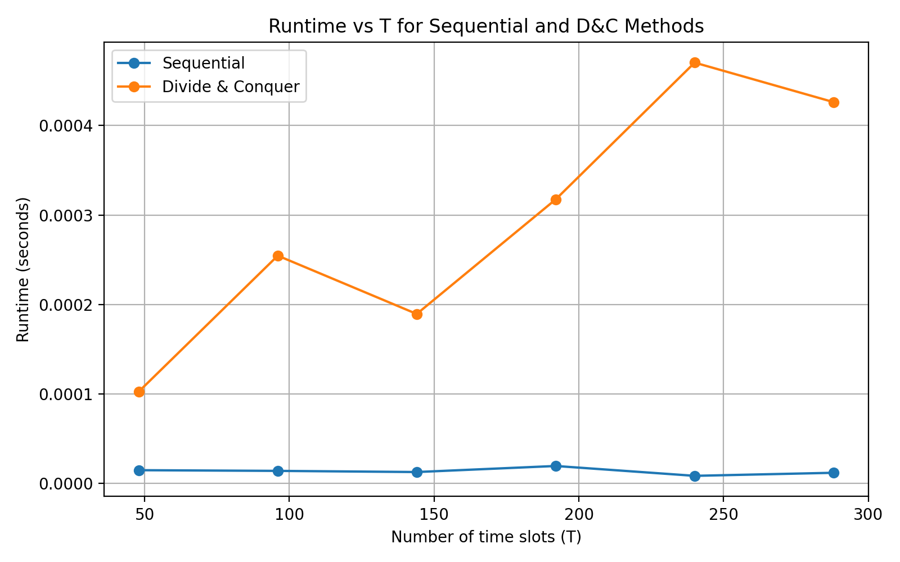

# ╔═══════════════════╗
#    MOST UTILIZED DOCK  
# ╚═══════════════════╝


---

# Most Utilized Dock — Algorithm Analysis Project

This project computes the **most utilized dock** from a binary occupancy matrix using:

- **Sequential Algorithm**
- **Divide & Conquer Algorithm** (column-split + recursive tournament)
- **Data preprocessing**
- **Timing experiments**
- **Scaling analysis**
- **Heatmap & bar chart visualizations**

---

## 📘 1. Problem Definition

We are given a binary matrix:

U ∈ {0,1}^{R×T}

- **R** = number of docks  
- **T** = number of time slots  
- `U[i, t] = 1` → dock *i* is occupied at time *t*

🎯 **Goal:** Find the dock with the maximum number of 1s.

---

## 📂 2. Data Preparation

Script:

src/data_prep.py

Produces:

data/occupancy.csv
data/info.json

Converts event logs into a clean 0/1 matrix.

---

## 🔢 3. Sequential Algorithm

File:

src/sequential.py

Logic:

- Sum each row  
- Track highest  
- Tie → smaller index wins  

Time: **Θ(RT)**  
Space: **O(1)**

---

## 🧩 4. Divide & Conquer Algorithm  
### (Suggested Method from Assignment)

File:

src/dac.py

✔ Column-split recursion  
✔ Row-count vector merge by vector addition  
✔ Recursive tournament argmax  
✔ Tie → smaller index wins  

Work: **Θ(RT)**  
Span: **Θ(log T)** (parallelizable)

---

## 📊 5. Visualizations

Generated automatically.

### Heatmap


### Bar Chart


### Runtime Scaling



---

## ⏱️ 6. Timing Experiments

Main script:

src/run_experiment.py

Does:

1. Correctness Test  
2. Full-matrix timing (mean ± std)  
3. Runtime vs T scaling experiment  
4. Saves results:

results/timings.csv
results/times.json

---

## 📐 7. Complexity Summary

| Algorithm | Work (Time) | Span | Space |
|----------|-------------|------|--------|
| Sequential | Θ(RT) | Θ(RT) | O(1) |
| Divide & Conquer | Θ(RT) | Θ(log T) | O(R) |

---

## 📁 8. Repository Structure
```bash
MostUtilizedDock/
│
├── data/
│ ├── events.csv
│ ├── occupancy.csv
│ └── info.json
│
├── plots/
│ ├── heatmap.png
│ ├── bar_chart.png
│ └── runtime_vs_T.png
│
├── results/
│ ├── timings.csv
│ └── times.json
│
├── src/
│ ├── data_prep.py
│ ├── sequential.py
│ ├── dac.py
│ └── run_experiment.py
│
└── README.md
```

---

## ▶️ 9. How to Run

```bash
cd src
python data_prep.py
python sequential.py
python dac.py
python run_experiment.py
```
